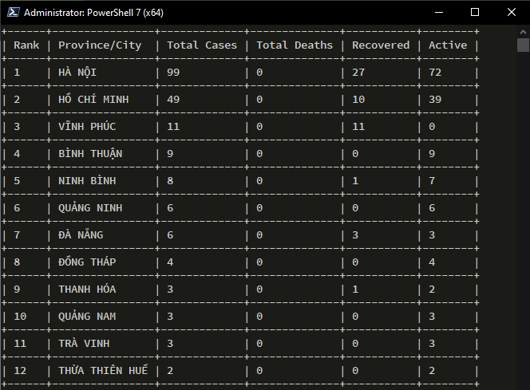

# covid-tracker-vn
Get information of Covid-19 in Vietnam from your terminal.

## Screenshot


## Sources
Get all information from 

## Install
```sh
#clone the repo
git clone https://github.com/khoatdk007/covid-tracker-vn.git
cd covid-tracker-vn

#install all neccessary modules
pip install requests texttable urllib3[secure] 

#run
python covid.py #show all provinces in Vietnam

#filter by province/city name
python covid.py Hà Nội
python covid.py Hải Phòng

```
